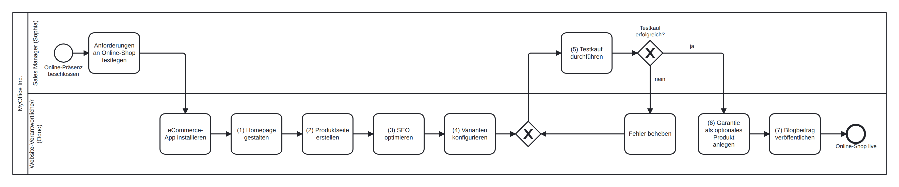
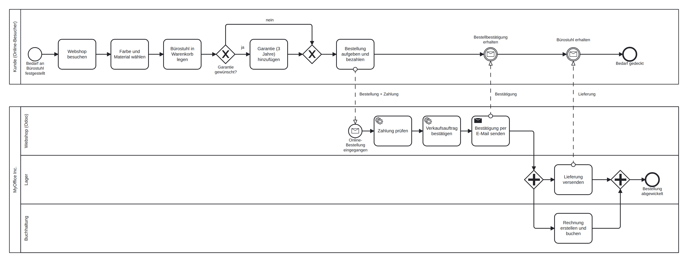

# Scale Up! Fallstudie „Sell Online“ – Leitfaden für die Vorstellung (SW3/SW4)

Modul Betriebliche Standard-Software (3BSS), HS26, Kleinklasse.
Case: **„Sell Online“ – MyOffice Inc.** (Web Shop, 7 Schritte, `ScaleUp.pdf`)
Gruppe: **Albin Ahmetaj, Cem Durdu, Leorat Krasniqi**

---

## 0. Was genau verlangt ist (aus euren Unterlagen)

| Vorgabe | Quelle |
|---|---|
| Vorstellung der Scale-Up-Fallstudie in der KK in **SW3 oder SW4** (SW3 = 28.09.–04.10.2026, **Anwesenheitspflicht**) | Semesterprogramm S. 1 + Kap. 5.2.2 |
| Inhalt: **(1) Übersicht zum Case als BPMN, (2) Live-Demonstration in einer Odoo-Instanz, (3) Learnings und Herausforderungen** | Semesterprogramm 5.2.2, Bewertungsraster |
| Zeit: **20 Minuten inkl. 5 Minuten Fragen**, also ca. 15 Minuten Vortrag | Semesterprogramm 5.2.2 |
| **Es werden keine Präsentationsslides benötigt.** Der Fokus liegt auf BPMN und Live-Demo in Odoo. | Folien SW02 KK, Folie „Scale Up!“ |
| Ziel: Die anderen Gruppen sollen einen Eindruck vom Case bekommen und **Tipps** erhalten („Ihr seid die Experten für den Case in der Klasse“) | Folien SW02 KK |
| BPMN erstellen, z. B. mit https://demo.bpmn.io/new oder Camunda | Folien SW02 KK |
| Bewertung: bis **10 Bonuspunkte (= 5 %)** für den Gruppenleistungsnachweis | Semesterprogramm 5.2.2, Bewertungsraster |
| Zuweisung laut Folie: **Gruppe 4 – Web Shop – „Sell Online“** | Folien SW02 KK, „Scale UP – Zuweisung“ |

> Prüft kurz, ob ihr wirklich „Sell Online“ zugeteilt bekommen habt (laut Folie Gruppe 4).
> Alles in diesem Ordner baut auf diesem Case auf.

**Inhalt dieses Ordners**

```
ScaleUp_SellOnline/
├── README.md                                   ← dieser Leitfaden
├── Drehbuch_Praesentation.md                   ← Sprechtext + Regie-Notizen für Albin, Cem, Leorat
├── Drehbuch_Praesentation.pdf                  ← dasselbe als PDF zum Ausdrucken
└── bpmn/
    ├── 01_ScaleUp_SellOnline_Einrichtung.bpmn    ← BPMN 1: der Case (7 Schritte), in demo.bpmn.io öffnen
    ├── 01_ScaleUp_SellOnline_Einrichtung.png/.svg
    ├── 02_ScaleUp_SellOnline_Bestellprozess.bpmn ← BPMN 2: Bestellprozess, den der Shop unterstützt
    └── 02_ScaleUp_SellOnline_Bestellprozess.png/.svg
```

Die `.bpmn`-Dateien könnt ihr auf https://demo.bpmn.io per Drag & Drop öffnen und dort weiter anpassen,
z. B. mit eurem Gruppennamen im Pool. In den Lanes stehen bewusst **Rollen** und keine Personennamen: Nach Weber (Kap. 3.5.3) ordnet man Aktivitäten *abstrakten Bearbeitern* (Rollen, Stellen) zu, weil Personen wechseln.

---

## 1. Ablauf der Präsentation (15 Min. + 5 Min. Fragen)

> 🎤 Den ausformulierten Sprechtext für jede Person, mit Regie-Notizen (was klicken, was zeigen), findet ihr in **[Drehbuch_Praesentation.md](Drehbuch_Praesentation.md)**.

Roter Faden: **Ausgangslage → Prozess (BPMN) → Umsetzung in Odoo (live) → was wir gelernt haben.**

Ihr seid **3 Personen: Albin Ahmetaj, Cem Durdu und Leorat Krasniqi**. Jede Person spricht ca. **5 Minuten** (so verlangt es auch das Raster für den späteren GLNW-Vortrag: „je Person ca. 5 Min“). Die Demo ist deshalb **nach Themen** aufgeteilt, nicht streng nach der Reihenfolge 1–7: Cem zeigt alles rund um **Website und Content** (Schritte 1, 2, 3, 7), Leorat alles rund um **Verkauf** (Schritte 4, 5, 6 plus Integration).

| Zeit | Wer | Teil | Inhalt |
|---|---|---|---|
| 0:00–1:00 | **Albin** | Einstieg | Gruppe und Namen vorstellen. Firma MyOffice Inc. (Büromöbel, lokal bekannt), Ziel des Cases: *Online-Präsenz aufbauen und online verkaufen*. Ablauf der nächsten 15 Minuten ansagen. |
| 1:00–4:00 | **Albin** | BPMN | BPMN 1 (Einrichtung, 7 Schritte) zeigen, dann BPMN 2 (Bestellprozess Kunde ↔ MyOffice). Die BPMN-Elemente erklären (siehe Kap. 2). |
| 4:00–8:30 | **Cem** | Live-Demo: Website & Content | (1) Homepage, (2) Produktseite „Office Chair“ inkl. KI-Text, (3) SEO, (7) Blogbeitrag |
| 8:30–13:30 | **Leorat** | Live-Demo: Verkauf & Integration | (4) Varianten, (6) Garantie als optionales Produkt, (5) **Testkauf** als Kunde, danach im Backend: Verkaufsauftrag → Lieferung (Lager) → Rechnung (Buchhaltung). **Ein System, abteilungsübergreifend** = BPMN 2 live. |
| 13:30–15:00 | **Albin, Cem, Leorat** | Learnings & Herausforderungen | Jede Person nennt **ein** Learning bzw. eine Herausforderung aus dem eigenen Teil (je ca. 30 Sek., siehe Kap. 5). Albin schliesst ab und eröffnet die Fragerunde. |
| 15:00–20:00 | alle | Fragen | Wer den Teil gezeigt hat, beantwortet die Frage dazu (siehe Kap. 6). |

Redezeit: Albin ca. 4:30, Cem ca. 5:00, Leorat ca. 5:30 Minuten.

**Übergabesätze** (wirken als „abgestimmte Kooperation“ und helfen gegen Hänger):

- Albin → Cem: „So sieht der Prozess auf dem Papier aus. Cem zeigt euch jetzt, wie wir die Website in Odoo aufgebaut haben.“
- Cem → Leorat: „Jetzt haben wir eine Website mit Produkt und Blog. Leorat zeigt, wie daraus ein Verkauf wird und was im Hintergrund passiert.“
- Leorat → Learnings: „Das war genau unser BPMN 2 live. Zum Schluss erzählt jede und jeder von uns, was wir gelernt haben.“

**Wer richtet was in Odoo ein (vor dem Termin)?** Jede Person richtet den Teil ein, den sie auch zeigt. So kann sie Fragen dazu sicher beantworten.

| Person | Einrichtung in Odoo (Kap. 3) | Zusätzlich |
|---|---|---|
| **Albin Ahmetaj** | 3.0 Vorbereitung: gemeinsame Instanz, Cem und Leorat als **Administrator** einladen, eCommerce- und Blog-App installieren, Website-Assistent | BPMN-Modelle in demo.bpmn.io öffnen und sicher erklären können (Kap. 2) |
| **Cem Durdu** | 3.1 Homepage, 3.2 Produktseite, 3.3 SEO, 3.7 Blog | Backup-Screenshots der Website |
| **Leorat Krasniqi** | 3.4 Varianten, 3.6 Garantie/Cross-Selling, 3.5 Zahlungsanbieter „Demo“, automatische Rechnung, Testkauf | Einen Testkauf komplett bis Lieferung und Rechnung durchspielen |

Tipp für später: Eure 3er-Gruppe muss im Gruppenleistungsnachweis die Bereiche *Verkauf + E-Commerce Shop*, *Einkauf + Lager + Produktion* und *CRM + Marketing* abdecken. Wer den Webshop jetzt einrichtet, hat für *Verkauf + E-Commerce* schon einen Vorsprung.

Tipps zur Form (das zählt im Raster für den GLNW-Vortrag ebenfalls: frei sprechen, Zeit einhalten, ausgewogene Redezeit von ca. 5 Min. pro Person):

- Ohne Folien reicht **ein Browserfenster mit Tabs** in dieser Reihenfolge:
  1. BPMN 1 (PNG oder demo.bpmn.io)
  2. BPMN 2
  3. Odoo-Backend (eingeloggt als Admin)
  4. Webshop in einem **privaten/Inkognito-Fenster** (für die Kundensicht)
- Eine optionale Titelseite (Gruppe, Namen, Case) wirkt professionell, ist aber nicht verlangt.
- Die Demo **mindestens einmal komplett durchspielen und stoppen**. Live-Demos dauern immer länger als gedacht.
- Macht vorher Screenshots der wichtigsten Ansichten als **Backup**, falls das WLAN oder Odoo ausfällt.

---

## 2. Die BPMN-Modelle und wie ihr sie erklärt

### BPMN 1 – „Einrichtung Online-Shop“ (der Case selbst)



- **Ein Pool** „MyOffice Inc.“ mit **zwei Lanes**: *Sales Manager (Sophia)* stellt die Anforderungen und testet, *Website-Verantwortliche/r* (im Case „You“) setzt in Odoo um.
- Innerhalb eines Pools verbinden **Sequenzflüsse** die Lanes (keine Nachrichtenflüsse, die gibt es nur zwischen Pools).
- Die Nummern **(1)–(7)** entsprechen den 7 Schritten im Scale-Up-PDF.
- **XOR-Gateway „Testkauf erfolgreich?“**: Bei „nein“ werden Fehler behoben und der Testkauf wird wiederholt (Schleife). Vor dem Testkauf steht deshalb ein **zusammenführendes XOR-Gateway**. Das entspricht der Regel aus der Vorlesung: *„Ein Pfeil rein und mehrere raus oder umgekehrt – nicht mischen!“*
- Aufgaben sind nach der Regel **[Objekt] + [Verb in Grundform]** beschriftet (z. B. „Homepage gestalten“).

### BPMN 2 – „Online-Bestellung“ (der Prozess, den der Shop danach unterstützt)



- **Zwei Pools**: *Kunde* und *MyOffice Inc.* Über die Poolgrenze laufen **Nachrichtenflüsse** (gestrichelt), nie Sequenzflüsse (Vorlesung SW02: „Nachrichten als Lösung zu Poolgrenzenüberschreitung“).
- MyOffice startet mit einem **Nachrichten-Startereignis** „Online-Bestellung eingegangen“. Der Kunde wartet mit **empfangenden Nachrichten-Zwischenereignissen** auf Bestätigung und Lieferung (jeweils ein Pfeil rein, ein Pfeil raus).
- **XOR-Gateway „Garantie gewünscht?“** steht für das Cross-Selling (Schritt 6): Odoo bietet beim Hinzufügen des Stuhls die Garantie als optionales Produkt an.
- **Service-Tasks (Zahnrad)** „Zahlung prüfen“ und „Verkaufsauftrag bestätigen“ macht Odoo automatisch, ohne Menschen. Nach Weber (Kap. 3.5.1) ist das eine *Hintergrundbearbeitung*, im Gegensatz zur *Dialogbearbeitung*.
- **Paralleles Gateway (UND)**: Lieferung (Lager) und Rechnung (Buchhaltung) laufen parallel. Erst wenn beides erledigt ist, ist die Bestellung abgewickelt (Token-Konzept: beide Tokens müssen am zusammenführenden Gateway ankommen).
- Die **Lanes Webshop, Lager und Buchhaltung** zeigen die *Bearbeiterzuordnung* (Weber 3.5.3). Alles läuft in **einem** System (Odoo) über **eine** Datenbank. Genau das ist das Lernziel der KK SW2: *„Operative Geschäftsprozesse sind abteilungsübergreifend in EINEM System abgebildet.“*

### Bezüge zur Vorlesung, die ihr erwähnen könnt

- **Order-to-Cash** (Dumas et al. 2018, GK SW2): BPMN 2 ist ein Order-to-Cash-Prozess, von der Bestellung bis zum Zahlungseingang.
- **Prozess vs. Projekt** (Selbststudiumsfrage GK SW2): Die *Einrichtung* des Shops (BPMN 1) ist eher ein einmaliges Projekt. Die *Online-Bestellung* (BPMN 2) ist ein wiederkehrender Geschäftsprozess, der tausendfach gleich abläuft.
- **Weber Kap. 3.5**: Eine Prozessdefinition umfasst *Kontrollfluss* (Sequenzflüsse/Gateways), *Datenfluss* (das Geschäftsobjekt „Verkaufsauftrag“ fliesst von Webshop zu Lager und Buchhaltung) und *Bearbeiterzuordnung* (Lanes).
- **Gronau Kap. 1.1.2 „ERP-Systeme als Integrationswerkzeug“ / GK SW1**: Integration von Anwendungssystemen, keine Medienbrüche. Die Webshop-Bestellung muss nicht noch einmal ins ERP eingetippt werden.
- **Prozesslandkarte (GK SW2)**: Der Webshop gehört zum Kernprozess *Auftragsabwicklung/Vertrieb*.

---

## 3. Odoo einrichten – Schritt für Schritt

> Die Anleitung ist für die aktuelle Odoo-Online-Version (odoo.com, Odoo 18/19) auf Deutsch geschrieben.
> Einzelne Menü- oder Blocknamen können je nach Version leicht anders heissen. Die Struktur bleibt gleich.
> Verwendet eine Instanz, auf die alle Gruppenmitglieder Zugriff haben (Anleitung „Odoo-Instanz anlegen“, Kap. 3.3.2: Benutzer als **Administrator** einladen).

### 3.0 Vorbereitung

1. Instanz nach der Anleitung „Odoo-Instanz anlegen“ (Verkauf, Buchhaltung, Lager, Einkauf; Zeitzone Europa/Zürich).
2. **Apps** → „eCommerce“ suchen → **Aktivieren/Installieren**. Die App *Website* wird dabei mitinstalliert.
3. Der Website-Assistent startet:
   - „Ich möchte einen **Online-Shop** für mein Unternehmen *Büromöbel / furniture accessories supplier* …“
   - Ziel: **Marke entwickeln** (*develop the brand*)
   - Farbpalette wählen
   - Zusatzfunktion **News/Blog** anhaken (braucht ihr für Schritt 7)
   - **Website erstellen**, dann Katalog- und Produktseiten-Layout wählen
4. Hinweis Währung und Steuern: Eure Instanz ist auf **Schweiz/CHF** eingestellt. Der Case rechnet mit **$ und 15 % Steuer**. Nehmt **CHF 120** und die Schweizer **MwSt 8.1 %**. Dann kostet der Stuhl beim Testkauf CHF 129.72 statt $138. Das ist ein gutes *Learning* (Kap. 5).
5. **Welche Website sehen Besucher?** Eine Odoo-Instanz kann **mehrere Websites** haben, oft die Standard-Website „My Website“ und die vom Assistenten erstellte „Website“. Erkennbar ist das am Umschalter **„Website ▾“** oben in der Admin-Leiste. Besucher ohne Login landen auf der Website, die zur Adresse passt, sonst auf der obersten in der Liste. So verknüpft ihr *eure* Website mit der Adresse:
   - **Website → Konfiguration → Einstellungen** → oben die Website wählen, auf der ihr arbeitet → Feld **Domain**: `https://<eure-instanz>.odoo.com` → **Speichern**.
   - Bei der anderen Website muss das Feld **Domain** leer sein.
   - Alternative: Unter **Website → Konfiguration → Websites** eure Website ganz nach oben ziehen.
   - „My Website“ nicht einfach löschen, Umstellen reicht.
   - Kontrolle: Im Inkognito-Fenster müssen Menü, Fusszeile und Tab-Titel gleich aussehen wie als Admin.

### Was muss genau wie im PDF sein – was dürft ihr frei wählen?

Faustregel: **Was Sophia oder „You“ in den Sprechblasen verlangen, ist eine Anforderung und wird genau so umgesetzt.** Alles, was nur auf den Beispielbildern zu sehen ist, ist Design und frei wählbar. Das PDF sagt es sogar selbst: *„You can choose a pre-made palette“* und *„Select your favorite online catalog and favorite product page“*.

| Genau so umsetzen (Anforderung) | Frei wählbar (Design) |
|---|---|
| Cover oben mit einem **Büro-Bild** als Hintergrund | Welches Büro-Bild genau |
| Kennzahlen **700+ / 120+ / 15** mit **Verlauf** im Hintergrund | Welcher Verlauf, Farbe, Schrift |
| **3 Spalten** „You Customize“, „We Design“, „We Manufacture“ (auch auf Deutsch ok) | Bilder und Beschreibungstexte in den Spalten |
| Produkt **Office Chair**, Preis **120** (CHF statt $), Beschreibung (mit KI) | Produktbild, Layout von Katalog und Produktseite |
| SEO mit dem Keyword **„office furniture“** | Genaue Formulierung von Titel und Beschreibung (die im PDF sind Beispiele) |
| Varianten: **Fabric/Leather** und **Grey/White/Purple mit den genauen RGB-Werten** | Anzeigetyp von „Material“ (Radio oder Pills) |
| Testkauf mit dem **violetten Stuhl** | – |
| Produkt **Garantie, 3 Jahre, 50**, als **optionales Produkt** beim Stuhl | – |
| Blogbeitrag über die Garantie im Blog **News** („Discover our 3-year warranty“) | Coverbild des Blogbeitrags |
| – | Farbpalette, Theme und Schriften im Website-Assistenten |

Das Design wird bei der Scale-Up-Vorstellung nicht bewertet. Das Raster nennt nur BPMN, Live-Demo sowie Learnings und Herausforderungen. Wenn ihr schnell sein wollt, wählt etwas Ähnliches wie im PDF. Eine eigene Wahl dürft ihr in der Demo aber gerne kurz begründen („passt zu Büromöbeln“).

### 3.1 Schritt 1 – Homepage gestalten

1. **Website** öffnen → oben rechts **Bearbeiten**.
2. **Cover-Block oben**: Block anklicken → rechts im Stil-Panel **Hintergrund → Bild → Ersetzen** → nach „office“ suchen. Odoo bietet kostenlose Bilder an.
   Titel z. B. „Bringing life to your interior“ bzw. „Office Furniture Store“.
3. **Kennzahlen-Block**: Links unter **Blöcke → Inhalt** den Block mit Zahlen (*Key Metrics/Kennzahlen/Zahlen*) auf die Seite ziehen.
   Werte eintragen: **700+ zufriedene Kunden, 120+ designte Produkte, 15 Länder beliefert**.
   Den Block anklicken → **Hintergrund → Verlauf (Gradient)** wählen.
4. **3 Spalten**: Block **Spalten/Columns** hinzufügen, Titel **„You Customize“, „We Design“, „We Manufacture“** (bzw. „Sie gestalten“, „Wir designen“, „Wir produzieren“), jeweils mit passendem Bild.
5. **Speichern**. Prüft, dass der Schalter **Veröffentlicht** grün ist. Mit dem Handy-Symbol könnt ihr die mobile Ansicht zeigen.

### 3.2 Schritt 2 – Produktseite „Office Chair“ erstellen

1. Auf der Website oben **+ Neu → Produkt**.
2. Produktname **Office Chair**, Verkaufspreis **120.00**, Steuer **8.1 %** (Case: 15 %) → **Speichern**.
3. Ihr landet auf der Produktseite → **Bearbeiten**:
   - Beschreibung eingeben. Mit dem **KI-Button** im Texteditor („AI“, Odoo 17+) einen Text generieren lassen, z. B. *„Office chair with extra cushions to make it comfortable when sitting for long periods …“*.
     Falls die KI in der Edu-Instanz nicht verfügbar ist (Credits), den Text selbst schreiben und das als Learning erwähnen.
   - Bild anklicken → **Hauptbild → Ersetzen** (Bürostuhl-Bild).
4. **Speichern**, Produkt ist **veröffentlicht**.

### 3.3 Schritt 3 – SEO optimieren

1. Zur **Homepage** gehen → im oberen Website-Menü **Site/Seite → SEO optimieren**.
2. **Titel**: „Office Furniture Available on Demand“ (bzw. deutsch).
3. **Beschreibung**: „Upgrade your workspace with durable, stylish, and functional office furniture …“
4. **Keyword** „office furniture“ (oder „Büromöbel“) eingeben → **Hinzufügen**. Odoo zeigt, ob das Keyword in H1/H2/Titel/Beschreibung/Inhalt vorkommt (Häkchen), und schlägt **verwandte Suchbegriffe** vor (z. B. *stores, center, near me*).
5. Verwandte Keywords hinzufügen und die Homepage-Überschrift entsprechend anpassen, z. B. **„Office Furniture Store – Your one-stop center for stylish and functional workspaces“**.
6. Speichern. Für die Demo lohnt sich die **Google-Vorschau** oben rechts im SEO-Dialog.

### 3.4 Schritt 4 – Produktvarianten konfigurieren

1. **Website → Konfiguration → Einstellungen** (oder **Verkauf → Konfiguration → Einstellungen**) → Bereich *Shop – Produkte / Produktkatalog* → **Varianten** anhaken → **Speichern**.
2. **Website → eCommerce → Produkte → Office Chair** → Tab **Attribute & Varianten**:
   - Zeile hinzufügen: Attribut **Material** (neu anlegen) mit den Werten **Fabric/Stoff** und **Leather/Leder**
   - Zeile hinzufügen: Attribut **Farbe/Color** mit den Werten **Grey, White, Purple**
3. Auf das Attribut **Farbe** klicken → interne Link-Pfeile → Attribut öffnen:
   - **Anzeigetyp: Farbe**
   - Farbwerte je Wert setzen:

   | Wert | RGB (aus dem Case) | Hex-Code |
   |---|---|---|
   | Grey | 130, 130, 150 | `#828296` |
   | White | 255, 255, 255 | `#FFFFFF` |
   | Purple | 113, 75, 103 | `#714B67` |

4. Beim Attribut **Material** eignet sich der Anzeigetyp **Radio** (wie im Case) oder **Pills**.
5. Speichern. Das Produkt hat nun **2 × 3 = 6 Varianten**. Das kann man im Tab bzw. über den Button „Varianten“ zeigen.

### 3.5 Schritt 5 – eCommerce testen (Testkauf)

Damit der Testkauf durchgeht und Odoo danach automatisch weiterarbeitet:

1. **Zahlungsanbieter**: **Website → Konfiguration → Zahlungsanbieter** (auch unter Buchhaltung/Rechnungsstellung → Konfiguration).
   - Empfohlen: Anbieter **„Demo“** aktivieren (Status **Testmodus**, veröffentlichen). Damit simuliert ihr eine erfolgreiche Kreditkartenzahlung, ohne echtes Geld.
   - Alternative: **Überweisung (Wire Transfer)**. Dann bleibt die Zahlung „ausstehend“, und die automatische Rechnung wird nicht erstellt.
   - Der Case erwähnt **Stripe** als Standard sowie PayPal, Adyen, Mollie usw. Das könnt ihr erwähnen, müsst es aber nicht einrichten.
2. **Automatisierung (optional, gutes Customizing-Beispiel)**: **Verkauf → Konfiguration → Einstellungen → Rechnungsstellung → „Automatische Rechnung“** aktivieren. Nach bestätigter Online-Zahlung erstellt Odoo die Rechnung selbst.
3. **Testkauf**: Ein **privates/Inkognito-Fenster** öffnen (sonst kauft ihr als Admin ein) → Shop → **Office Chair** → Farbe **Purple**, Material **Fabric** → **In den Warenkorb** → **Kasse** → Adresse eingeben → mit **Demo** bezahlen.
4. **Backend zeigen (Integration!)**:
   - **Verkauf → Aufträge** bzw. **Website → eCommerce → Aufträge**: Der Auftrag ist automatisch **bestätigt** (Verkaufsauftrag).
   - Im Auftrag den Smart-Button **Lieferung** öffnen: **Lager** kann jetzt kommissionieren → **Validieren**.
   - Smart-Button **Rechnung**: Die **Buchhaltung** sieht die Rechnung, bei aktivierter automatischer Rechnung bereits bezahlt/abgeglichen.
   - Damit habt ihr BPMN 2 live gezeigt.

### 3.6 Schritt 6 – Cross-Selling: Garantie als optionales Produkt

1. **Website → eCommerce → Produkte → Neu**:
   - Name **„Warranty: 3 years“ / „Garantie: 3 Jahre“**
   - **Produkttyp: Dienstleistung/Service**. Bei einer Dienstleistung entsteht keine Lieferung, nur eine Rechnungszeile.
   - Verkaufspreis **50.00**, *Kann verkauft werden* angehakt
   - **Wichtig: auf der Website veröffentlichen.** Sonst erscheint die Garantie im Shop nicht.
2. **Office Chair** öffnen → Tab **Verkauf** → Feld **Optionale Produkte** → „Warranty: 3 years“ hinzufügen → Speichern.
3. Testen: Im Shop den Stuhl **in den Warenkorb** legen. Es erscheint ein **Pop-up**, das die Garantie anbietet (Cross-Selling).
4. Zum Erwähnen: **Alternative Produkte** (Upselling, z. B. teurerer Stuhl) und **Zubehörprodukte** (werden im Warenkorb vorgeschlagen) findet ihr im Tab eCommerce/Verkauf.

### 3.7 Schritt 7 – Blogbeitrag schreiben

1. Auf der Website **+ Neu → Blogbeitrag**. Falls der Punkt fehlt: App **Blog** installieren.
2. Blog **News** wählen, Titel **„Discover our 3-year warranty“ / „Entdecken Sie unsere 3-Jahres-Garantie“** → Speichern.
3. Titelbereich anklicken → im Stil-Panel **Hintergrund → Kamera-Symbol** → Coverbild wählen (z. B. Handschlag).
4. Text schreiben, z. B. „An extension of the warranty to enjoy your furniture even more!“, und einen Link zum Office Chair setzen.
5. **Speichern** und **veröffentlichen**. Neue Blogbeiträge sind in Odoo standardmässig **unveröffentlicht**. Oben rechts im Beitrag den Schalter auf **Veröffentlicht** (grün) stellen.
6. Kontrolle im **Inkognito-Fenster**: `https://<eure-instanz>.odoo.com/blog` öffnen. Wird der Beitrag nicht angezeigt:
   - **404-Seite mit anderem Menü/Fusszeile als beim Admin** (Tab-Titel z. B. „… | My Website“)? Dann sieht der Besucher eine **andere Website**. Lösung siehe 3.0, Punkt 5 (Domain bei eurer Website eintragen). Das betrifft dann auch Homepage, Produkte und SEO.
   - Ist der Schalter wirklich grün? Als Admin seht ihr auch unveröffentlichte Beiträge, Besucher nicht.
   - Liegt das **Veröffentlichungsdatum** in der Zukunft? Dann ist der Beitrag nur geplant. Datum auf heute setzen (im Backend unter **Website → Site → Blogbeiträge** im Beitrag).
   - Wurde nach dem Bearbeiten **Speichern** geklickt?
   - Steht der Beitrag im **richtigen Blog**? Wenn es mehrere Blogs gibt (z. B. „Unser Blog“ und „Neuigkeiten“), zeigt die Menüseite nur die Beiträge *ihres* Blogs. In der Liste **Website → Site → Blogbeiträge** die Spalte **Blog** prüfen und im Beitrag bei Bedarf umstellen.
   - Schnelltest: Die URL des Beitrags (`/blog/<blog-name>/<beitrag>`) ins Inkognito-Fenster kopieren. Erscheint er dort, ist er veröffentlicht, und das Problem liegt beim Blog oder Menü. Erscheint „Seite nicht gefunden“, ist er nicht veröffentlicht oder das Datum liegt in der Zukunft.
   - Fehlt im Hauptmenü der Eintrag „Blog/News“? Dann **Website → Site → Menü bearbeiten** und einen Eintrag mit der URL `/blog` hinzufügen.

---

## 4. Demo-Drehbuch (was ihr live klickt, ca. 9–10 Min.)

Alles vorher einrichten. Live wird nur **gezeigt** und höchstens **ein kleiner Schritt live ausgeführt**, damit es interaktiv bleibt, aber nichts schiefgehen kann.

**Cem – Website & Content (ca. 4:30)**

1. **Homepage** (Kundensicht, Inkognito): Cover, Kennzahlen mit Verlauf, 3 Spalten. Kurz in den **Bearbeiten**-Modus (Admin-Fenster) und zeigen, wie ein Block per Drag & Drop hinzukommt.
2. **Produktseite** Office Chair: Beschreibung (mit KI erstellt) und Bild. Kurz zeigen, wie man mit **+ Neu → Produkt** ein Produkt direkt auf der Website anlegt.
3. **SEO**: Dialog *SEO optimieren* öffnen, Keyword-Tabelle mit Häkchen und Vorschlägen, Google-Vorschau.
4. **Blog**: Beitrag „Discover our 3-year warranty“ zeigen und damit zu Leorat überleiten („… und diese Garantie kann man jetzt direkt beim Stuhl dazukaufen“).

**Leorat – Verkauf & Integration (ca. 5:00)**

5. **Varianten**: Backend-Formular Office Chair → Tab **Attribute & Varianten** → Anzeigetyp Farbe mit Hex-Codes → 6 Varianten.
6. **Garantie**: Produkt „Warranty: 3 years“ (Dienstleistung, 50.–) und das Feld **Optionale Produkte** beim Stuhl zeigen.
7. **Testkauf** (Inkognito): Produktseite mit Farbkreisen und Material-Auswahl → **Purple + Fabric** → *In den Warenkorb* → **Pop-up mit Garantie** (Cross-Selling) → Garantie hinzufügen → Checkout → mit **Demo-Zahlung** bezahlen → Bestellbestätigung.
8. **Backend (Admin-Fenster)**: Verkaufsauftrag ist bestätigt → **Lieferung** (nur der Stuhl, nicht die Garantie, weil die eine Dienstleistung ist!) → **Rechnung**. Dazu sagen: „Das ist genau unser BPMN 2: Webshop, Lager und Buchhaltung in einem System.“

---

## 5. Learnings und Herausforderungen (Vorschläge – ergänzt eure eigenen!)

Nehmt die Punkte, die ihr **selbst erlebt** habt. Echte Erfahrungen überzeugen mehr als eine Liste.

Vorschlag, wer welches Learning nennt (je ca. 30 Sek.):

- **Albin:** Prozess vs. Projekt, deshalb zwei BPMN-Modelle
- **Cem:** Zwei Websites in einer Instanz – Besucher sahen die falsche (siehe Herausforderungen, sehr gutes echtes Beispiel!) oder Standardsoftware statt Programmierung (Website, SEO und Blog ohne Code) oder Währung/Steuern bzw. KI-Credits als Herausforderung
- **Leorat:** Integration in einem System (Bestellung → Lieferung → Rechnung) oder „Garantie muss veröffentlicht sein“ als Tipp an die anderen Gruppen

**Learnings**

- **Integration in einem System**: Eine Webshop-Bestellung erzeugt ohne erneute Eingabe einen Verkaufsauftrag, eine Lieferung und eine Rechnung. Das ist der Kernnutzen eines ERP (Gronau Kap. 1.1.2).
- **Stammdaten sind zentral**: Das Produkt „Office Chair“ ist *ein* Datensatz, den Website, Verkauf, Lager und Buchhaltung gemeinsam nutzen. Varianten sind eigene Produkte (6 Stück) mit gemeinsamer Vorlage.
- **Standardsoftware statt Programmierung**: Homepage, SEO, Varianten, Cross-Selling und Blog gehen komplett per Konfiguration/Customizing, ohne Code.
- **Produkttyp steuert den Prozess**: Die Garantie als *Dienstleistung* erzeugt keine Lieferung, der Stuhl als *Gut* schon.
- **Prozess vs. Projekt**: Die Einrichtung ist einmalig (Projekt), der Bestellprozess wiederholt sich (Geschäftsprozess). Deshalb haben wir zwei BPMN-Modelle.

**Herausforderungen / Tipps für die anderen Gruppen**

- **Währung und Steuern**: Der Case rechnet in $ mit 15 %, die Schweizer Instanz in CHF mit 8.1 % MwSt. Die Beträge weichen deshalb vom PDF ab.
- **Optionales Produkt erscheint nicht?** Die Garantie muss selbst **auf der Website veröffentlicht** und verkaufbar sein.
- **Zwei Websites in einer Instanz** (bei uns selbst passiert): Wir haben alles auf der Website „Website“ gebaut, Besucher landeten aber auf „My Website“ und bekamen beim Blogbeitrag eine 404-Seite. Erkannt haben wir es am anderen Menü, an der anderen Fusszeile und am Tab-Titel. Gelöst haben wir es, indem wir unter *Website → Konfiguration → Einstellungen* die Domain bei der richtigen Website eingetragen haben. Learning: Odoo ist **mehrwebsitefähig** (ähnlich wie die Mandantenfähigkeit bei Weber, Kap. 3.3.3), und jeder Inhalt gehört zu einer bestimmten Website.
- **Unveröffentlichte Inhalte**: Neue Blogbeiträge (und neu angelegte Produkte) sind oft zuerst nicht veröffentlicht. Als Admin sieht man sie trotzdem, im Inkognito-Fenster nicht. Deshalb jeden Schritt als Besucher kontrollieren.
- **Als Admin eingeloggt** sieht man den Shop anders (Bearbeiten-Leiste, Admin als Kunde). Testkäufe deshalb im **Inkognito-Fenster** machen.
- **Zahlung im Testmodus**: Ohne aktiven Zahlungsanbieter kann man nicht auschecken. „Demo“ im Testmodus ist die einfachste Lösung.
- **Farbvarianten**: Die Farbe erscheint nur als Farbkreis, wenn beim Attribut der **Anzeigetyp „Farbe“** gewählt ist. Die RGB-Werte müssen als Hex-Code eingegeben werden.
- **KI-Textfunktion** braucht Credits (IAP) und steht in der Edu-Instanz evtl. nur eingeschränkt zur Verfügung.
- **Unterschiede zur Case-Vorlage**: Die Bilder im PDF sind vereinfachte Darstellungen auf Englisch. In der deutschen Instanz heissen Menüs, Buttons und Blöcke anders, deshalb lohnt es sich, die Suche in den Einstellungen zu nutzen.

---

## 6. Mögliche Fragen aus dem Publikum (mit Antwortideen)

| Frage | Antwortidee |
|---|---|
| Warum zwei BPMN-Modelle? | BPMN 1 zeigt den Case (Einrichtung, einmalig). BPMN 2 zeigt den wiederkehrenden Prozess, den der Shop ermöglicht, und die Integration über Abteilungen hinweg. |
| Warum Nachrichtenflüsse statt Sequenzflüsse zwischen Kunde und MyOffice? | Sequenzflüsse dürfen Poolgrenzen nicht überschreiten. Zwischen zwei Organisationen/Pools kommuniziert man über Nachrichten. |
| Warum ein UND- und kein XOR-Gateway bei Lieferung/Rechnung? | Beides muss passieren und kann parallel laufen. Beim XOR würde nur *ein* Pfad ausgeführt. |
| Was passiert, wenn die Zahlung fehlschlägt? | Der Auftrag bleibt ein Angebot/Warenkorb und wird nicht bestätigt, es entsteht keine Lieferung. Im BPMN könnte man das mit einem weiteren XOR „Zahlung erfolgreich?“ ergänzen. |
| Wo sieht man in Odoo die Varianten? | Tab *Attribute & Varianten* bzw. Smart-Button *Varianten* im Produkt. 2 Materialien × 3 Farben = 6 Varianten. |
| Unterschied optionale Produkte / Zubehör / Alternativen? | *Optional*: Pop-up beim Hinzufügen (Cross-Sell). *Zubehör*: Vorschlag im Warenkorb. *Alternative*: anderes, oft teureres Produkt auf der Produktseite (Upsell). |
| Kann man unterschiedliche Preise pro Variante haben? | Ja, über einen **Preisaufschlag** (Extra-Preis) je Attributwert, z. B. Leder +30. |
| Wie wird der Shop bei Google gefunden? | Über die SEO-Einstellungen (Titel, Beschreibung, Keywords) pro Seite. Odoo erzeugt zusätzlich automatisch eine Sitemap. |
| Was würdet ihr als Nächstes automatisieren? | z. B. automatische Rechnung nach Zahlung, E-Mail-Vorlagen, Mindestbestand/Nachbestellregel für Stühle (Einkauf). |

---

## 7. Checkliste vor dem Termin

- [ ] Case-Zuteilung „Sell Online“ bestätigt
- [ ] Alle 3 Gruppenmitglieder haben Admin-Zugriff auf **eine** gemeinsame Odoo-Instanz
- [ ] eCommerce + Blog installiert, Schritte 1–7 eingerichtet
- [ ] Im Inkognito-Fenster geprüft: Besucher sehen **eure** Website (gleiches Menü und gleiche Fusszeile wie als Admin), mit Homepage, Office Chair und Blogbeitrag
- [ ] Zahlungsanbieter „Demo“ im Testmodus aktiv, ein Testkauf komplett durchgespielt (inkl. Lieferung und Rechnung)
- [ ] BPMN-Dateien in demo.bpmn.io geöffnet, ggf. mit euren Namen ergänzt
- [ ] Browser-Tabs vorbereitet (BPMN 1, BPMN 2, Backend, Inkognito-Shop)
- [ ] Rollen klar (Albin: Einstieg + BPMN, Cem: Website & Content, Leorat: Verkauf & Integration), Probedurchlauf mit Stoppuhr (≤ 15 Min., je Person ca. 5 Min.)
- [ ] Übergabesätze geübt, jede Person hat ihr Learning formuliert
- [ ] Backup-Screenshots, falls WLAN oder Odoo ausfällt (Hinweis: im ZHAW-VPN kann keine Instanz *angelegt* werden, der Zugriff auf eine bestehende funktioniert)
- [ ] Learnings aus eigener Erfahrung formuliert

---

## Quellen

- ZHAW (2026): Semesterprogramm w.BA.XX.3BSS HS26, Kap. 5.2.2 (Scale-Up-Vorstellung).
- ZHAW (2026): Beurteilungsraster GLNW BSS HS2026.
- Geppert, T.: Folien SW01/SW02 Grossklasse und Kleinklasse (Betriebliche Standard-Software, Prozesse, BPMN, Scale Up!).
- Geppert, T. (2026): Odoo-Instanz anlegen – Anleitung, V1.7.
- Odoo S.A.: Scale Up! Business Game – „Sell Online“ (ScaleUp.pdf).
- Freund, J. & Rücker, B. (2019): Praxishandbuch BPMN, 6. Aufl., Hanser.
- Weber, R. (2021): Betriebliche Anwendungssysteme, 2. Aufl., Springer Vieweg, Kap. 3.5 Geschäftsprozesse.
- Gronau, N. (2021): ERP-Systeme, 4. Aufl., De Gruyter Oldenbourg, Kap. 1.1.2.
- Dumas, M., La Rosa, M., Mendling, J. & Reijers, H. A. (2018): Fundamentals of Business Process Management, 2. Aufl., Springer.
